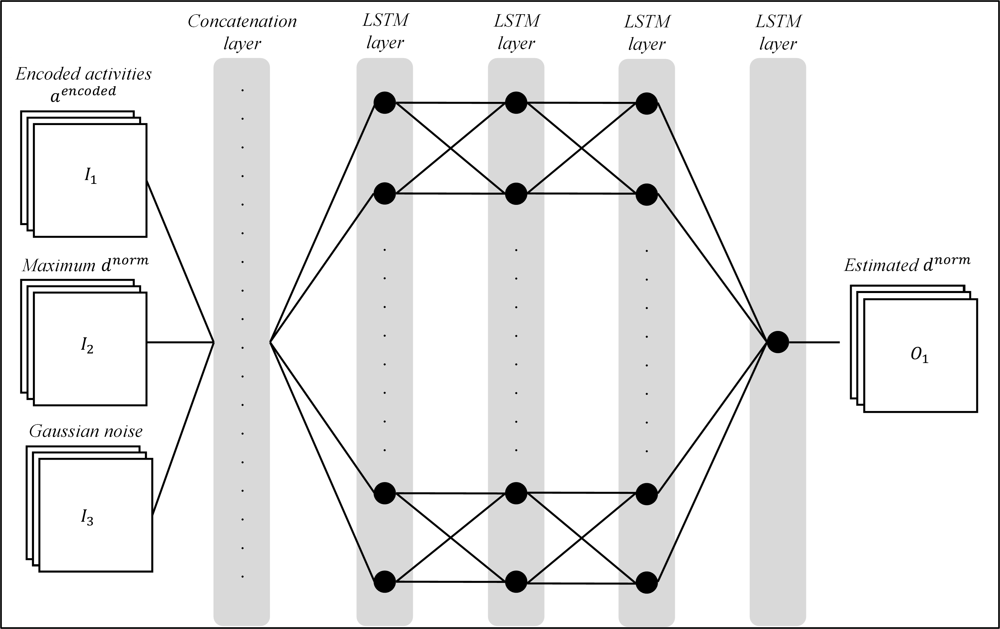

# Identical-Timestamp-Repair
Process mining generates valuable insights into business processes through the analysis of event logs. However, event logs are commonly subject to various data quality issues which hinder the success of process mining initiatives in organizations. Identical timestamp errors, for example, occur when multiple events of a process instance mistakenly share the same timestamp. This error causes discovered process models to be unrepresentative and process performance analysis results to be misleading. To address this problem, we propose a method for automatically repairing identical timestamp errors in event logs. To that end, we combine existing method components for error detection and reordering of erroneous events with a novel approach for repairing timestamps based on Generative Adversarial Networks. 

## Chosen architecture
To account for the sequential nature of event data, we choose an LSTM-based GAN. An Illustration of the generator can be found below.

An Illustration of the generator can be found below.

## Results
We evaluated our approach by repairing six event logs in 30 different variations. We compare the performance of our approach against available baselines. The results for one exemplary real-life event log can be seen below.

